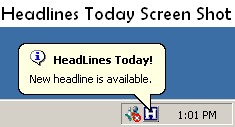



## HeadLines Today

### Description

HeadLines Today sits in the system tray and pops up a Ballon tooltip every time it finds a News Headline from India &amp; around the world. Clicking on the System tray icon displays the headline in the Titlebar. It keeps you updated of whats happening around the world while you are working on your PC.
 
### More Info
 
It uses Winsock control and needs an Internet connection to fetch the News Headlines.

             |
---                |---
**Submitted On**   |2005-10-06 15:33:52
**By**             |[Nitin Shinde](https://github.com/Planet-Source-Code/PSCIndex/blob/master/ByAuthor/nitin-shinde.md)
**Level**          |Advanced
**User Rating**    |5.0 (10 globes from 2 users)
**Compatibility**  |VB 5\.0, VB 6\.0
**Category**       |[Internet/ HTML](https://github.com/Planet-Source-Code/PSCIndex/blob/master/ByCategory/internet-html__1-34.md)
**World**          |[Visual Basic](https://github.com/Planet-Source-Code/PSCIndex/blob/master/ByWorld/visual-basic.md)
**Archive File**   |[HeadLines\_1937821062005\.zip](https://github.com/Planet-Source-Code/nitin-shinde-headlines-today__1-62778/archive/master.zip)

